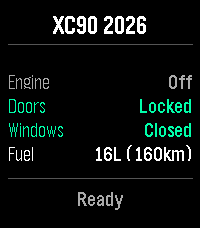
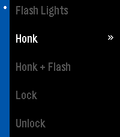

# ReVolver

**Re**mote **Vol**vo controll**er** — also _volver_ (Spanish): "to return/come back" to your car :)

Remote control your Volvo from your Pebble smartwatch.

## Features

- ⚡ Flash exterior lights
- 📯 Honk / Honk + Flash
- 🔒 Lock / Unlock doors
- ❄️ Climate on / off
- 🚗 Engine start / stop (with duration picker)
- 📊 Live dashboard: engine, doors, windows, fuel & range
- 🔄 Loading spinner while fetching data
- 🔔 Haptic feedback on command result (configurable)
- 🎯 Dynamic command menu (only shows what your car supports)
- 🔐 Confirmation prompts for sensitive actions (unlock, engine start)

## Screenshots

<p align="center">
  
  &nbsp;&nbsp;
  
</p>

## Supported Platforms

- Aplite (Pebble Classic)
- Basalt (Pebble Time)
- Chalk (Pebble Time Round)
- Diorite (Pebble 2)
- Emery (Pebble Time 2)

## How It Works

```
Pebble Watch ←BT→ Phone (PebbleKit JS) ←HTTPS→ Volvo Connected Vehicle API
                         ↕
                   AWS Lambda (OAuth token exchange)
```

1. User authenticates once with Volvo ID (OAuth2 + PKCE)
2. Tokens stored on phone, auto-refreshed when expired
3. Commands sent directly to Volvo API from phone JS
4. Watch displays status and sends command requests over Bluetooth

## Project Layout

```
src/c/main.c             Entry point
src/c/modules/           Messaging, commands logic
src/c/windows/           Main window UI
src/pkjs/index.js        Phone JS — API calls, token management, commands
src/pkjs/config.json     Clay settings page (VIN input, vibration toggle)
infra/                   AWS CDK stack (Lambda token exchange)
  infra/lambda/          Lambda function code
  infra/lib/             CDK stack definition
doc/                     Documentation
resources/images/        App icon and screenshots
```

## Building

```bash
pebble build                        # Build for all platforms
pebble install --emulator basalt    # Install on emulator
```

## Setup

### 1. Volvo Developer Account

Register at https://developer.volvocars.com and create an application to get:

- Client ID
- Client Secret
- VCC API Key

### 2. Deploy Auth Backend

```bash
# Store secrets in AWS SSM (one time)
aws ssm put-parameter --name /revolver/client-id --value "..." --type SecureString
aws ssm put-parameter --name /revolver/client-secret --value "..." --type SecureString
aws ssm put-parameter --name /revolver/vcc-api-key --value "..." --type SecureString
aws ssm put-parameter --name /revolver/redirect-uri --value "https://piotrserafin.github.io/ReVolverAuth/" --type String
aws ssm put-parameter --name /revolver/allowed-origins --value "https://piotrserafin.github.io,https://piotrserafin.dev" --type String

# Deploy Lambda
cd infra
python3 -m venv .venv && source .venv/bin/activate
pip install -r requirements.txt
cdk deploy
```

### 3. Install on Watch

```bash
pebble build
pebble install --phone <IP>
```

### 4. Configure

1. Open ReVolver settings on phone (Pebble app → ReVolver → Settings)
2. Enter your VIN
3. Click "Log in with Volvo ID"
4. Authenticate with your Volvo ID credentials
5. Done — app shows "Ready"

## Usage

- **UP** — Refresh car status
- **SELECT** — Open command menu
- **Pick a command** — Executes immediately, status shows result
- **Vibration** — Single pulse = success, triple = error

## Documentation

| Document                       | Content                                  |
| ------------------------------ | ---------------------------------------- |
| [doc/api.md](doc/api.md)       | Volvo API endpoints and response formats |
| [doc/scopes.md](doc/scopes.md) | Volvo OAuth scopes reference             |

## Security

- `client_secret` never leaves AWS (stored in SSM, used by Lambda only)
- Volvo requires client_secret (not pure PKCE) — server-side proxy is mandatory
- OAuth2 PKCE prevents authorization code interception
- VCC API key delivered with tokens (not hardcoded in app)
- Lambda wrapped in try/catch to prevent secret leaks in CloudWatch
- All communication over HTTPS
- No secrets in source code or app binary
- See [PRIVACY.md](PRIVACY.md) for full details

## License

MIT
